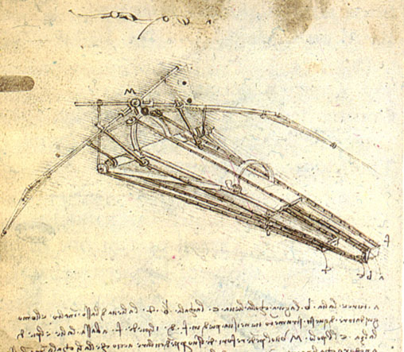

# davinci
<html>

<head>
<meta name="viewport" content="width=device-width, initial-scale=1">

  </head>
  <body>
  

  <h1 id="myHeader" style="font-family:Lucida Handwriting;" >Leonardo da Vinci</h1>

  <a  href="#myHeader">Home</a>
  <a  href="#life">Leonardo da Vinci's life</a>
  <a  href="#paintings">Paintings</a>
  <a  href="#studies">Scientific studies</a>
  <a  href="#anatomy">Anatomy and physiology</a>
  <a  href="#engineering">Engineering and inventions</a>
  <a  href="#journals">Journals and notes</a>
<a  href="#gallery">Gallery</a>
 
  

  

  

<article>
<h1 class="leonardo" id="life"><b>Leonardo da Vinci's life</b></h1>
  <h1 >Childhood, 1452–1466</h1>

  
Leonardo was born on 15 April 1452 (Old Style) "at the third hour of the night" in the Tuscan hill town of Vinci, in the lower valley of the Arno river in the territory of the Medici-ruled Republic of Florence. He was the out-of-wedlock son of the wealthy Messer Piero Fruosino di Antonio da Vinci, a Florentine legal notary, and Caterina, a peasant. Leonardo had no surname in the modern sense – "da Vinci" simply meaning "of Vinci"; his full birth name was "Lionardo di ser Piero da Vinci", meaning "Leonardo, (son) of (Mes)ser Piero from Vinci". The inclusion of the title "ser" indicated that Leonardo's father was a gentleman.

  
Little is known about Leonardo's early life. He spent his first five years in the hamlet of Anchiano in the home of his mother, and from 1457 lived in the household of his father, grandparents and uncle in the small town of Vinci. His father had married a sixteen-year-old girl named Albiera Amadori, who loved Leonardo but died young in 1465 without children. When Leonardo was sixteen (1468), his father married again to twenty-year-old Francesca Lanfredini, who also died without children. Piero's legitimate heirs were born from his third wife Margherita di Guglielmo (who gave birth to six children: Antonio, Giulian, Maddalena, Lorenzo, Violante and Domenico) and his fourth and final wife, Lucrezia Cortigiani (who bore him another six children: Margherita, Benedetto, Pandolfo, Guglielmo, Bartolomeo and Giovanni).

  
In all, Leonardo had twelve half-siblings, who were much younger than him (the last was born when Leonardo was forty years old) and with whom he had very few contacts, but they caused him difficulty after his father's death in the dispute over the inheritance.

  
Leonardo received an informal education in Latin, geometry and mathematics. In later life, Leonardo recorded only two childhood incidents. One, which he regarded as an omen, was when a kite dropped from the sky and hovered over his cradle, its tail feathers brushing his face. The second occurred while he was exploring in the mountains: he discovered a cave and was both terrified that some great monster might lurk there and driven by curiosity to find out what was inside.

  
Leonardo's early life has been the subject of historical conjecture. Vasari, the 16th-century biographer of Renaissance painters, tells a story of Leonardo as a very young man: A local peasant made himself a round shield and requested that Ser Piero have it painted for him. Leonardo responded with a painting of a monster spitting fire that was so terrifying that Ser Piero sold it to a Florentine art dealer, who sold it to the Duke of Milan. Meanwhile, having made a profit, Ser Piero bought a shield decorated with a heart pierced by an arrow, which he gave to the peasant.

  <a href="#myHeader" class="button">Home</a>
  <h1>Verrocchio's workshop, 1466–1476</h1>

  
In 1466, at the age of fourteen, Leonardo was apprenticed to the artist Andrea di Cione, known as Verrocchio, whose bottega (workshop) was "one of the finest in Florence". He apprenticed as a garzone (studio boy) to Andrea del Verrocchio, the leading Florentine painter and sculptor of his day (and would do so for 7 years). Other famous painters apprenticed or associated with the workshop include Domenico Ghirlandaio, Perugino, Botticelli, and Lorenzo di Credi. Leonardo would have been exposed to both theoretical training and a vast range of technical skills, including drafting, chemistry, metallurgy, metal working, plaster casting, leather working, mechanics and carpentry as well as the artistic skills of drawing, painting, sculpting and modelling.

  
Much of the painted production of Verrocchio's workshop was done by his employees. According to Vasari, Leonardo collaborated with Verrocchio on his The Baptism of Christ, painting the young angel holding Jesus' robe in a manner that was so far superior to his master's that Verrocchio put down his brush and never painted again, although this is believed to be apocryphal. Close examination reveals areas that have been painted or touched-up over the tempera using the new technique of oil paint; the landscape, the rocks seen through the brown mountain stream and much of the figure of Jesus bearing witness to the hand of Leonardo. Leonardo may have been the model for two works by Verrocchio: the bronze statue of David in the Bargello and the Archangel Raphael in Tobias and the Angel.

  
By 1472, at the age of twenty, Leonardo qualified as a master in the Guild of Saint Luke, the guild of artists and doctors of medicine, but even after his father set him up in his own workshop, his attachment to Verrocchio was such that he continued to collaborate with him. Leonardo's earliest known dated work is a drawing in pen and ink of the Arno valley, drawn on 5 August 1473.

  <a href="#myHeader" class="button">Home</a>
  <h1>Professional life, 1476–1513</h1>
  
  
  
Florentine court records of 1476 show that Leonardo and three other young men were charged with sodomy but acquitted; homosexual acts were illegal in Renaissance Florence. From that date until 1478 there is no record of his work or even of his whereabouts. In 1478, he left Verrocchio's studio and was no longer a resident at his father's house. One writer, called the Anonimo Gaddiano, claims that in 1480 Leonardo was living with the Medici and working in the Garden of the Piazza San Marco in Florence, a Neo-Platonic academy of artists, poets and philosophers that the Medici had established. In January 1478, he received an independent commission to paint an altarpiece for the Chapel of St. Bernard in the Palazzo Vecchio; in March 1481, he received a second independent commission for The Adoration of the Magi for the monks of San Donato a Scopeto. Neither commission was completed, the second being interrupted when Leonardo went to Milan.

  
In 1482, Leonardo, who according to Vasari was a talented musician, created a silver lyre in the shape of a horse's head. Lorenzo de' Medici sent Leonardo to Milan, bearing the lyre as a gift, to secure peace with Ludovico Sforza, Duke of Milan. At this time Leonardo wrote an often-quoted letter describing the many marvellous and diverse things that he could achieve in the field of engineering and informing Ludovico that he could also paint.

  
Leonardo worked in Milan from 1482 until 1499. He was commissioned to paint the Virgin of the Rocks for the Confraternity of the Immaculate Conception and The Last Supper for the monastery of Santa Maria delle Grazie. In the spring of 1485, Leonardo travelled to Hungary on behalf of Ludovico to meet Matthias Corvinus, for whom he is believed to have painted a Holy Family.Between 1493 and 1495, Leonardo listed a woman called Caterina among his dependents in his taxation documents. When she died in 1495, the list of funeral expenditures suggests that she was his mother.

  
Leonardo was employed on many different projects for Ludovico, including the preparation of floats and pageants for special occasions, designs for a dome for Milan Cathedral and a model for a huge equestrian monument to Francesco Sforza, Ludovico's predecessor. Seventy tons of bronze were set aside for casting it. The monument remained unfinished for several years, which was not unusual for Leonardo. In 1492, the clay model of the horse was completed. It surpassed in size the only two large equestrian statues of the Renaissance, Donatello's Gattamelata in Padua and Verrocchio's Bartolomeo Colleoni in Venice, and became known as the "Gran Cavallo". Leonardo began making detailed plans for its casting; however, Michelangelo insulted Leonardo by implying that he was unable to cast it. In November 1494, Ludovico gave the bronze to be used for cannon to defend the city from invasion by Charles VIII.

  
At the start of the Second Italian War in 1499, the invading French troops used the life-size clay model for the Gran Cavallo for target practice. With Ludovico Sforza overthrown, Leonardo, with his assistant Salai and friend, the mathematician Luca Pacioli, fled Milan for Venice, where he was employed as a military architect and engineer, devising methods to defend the city from naval attack. On his return to Florence in 1500, he and his household were guests of the Servite monks at the monastery of Santissima Annunziata and were provided with a workshop where, according to Vasari, Leonardo created the cartoon of The Virgin and Child with St Anne and St John the Baptist, a work that won such admiration that "men and women, young and old" flocked to see it "as if they were attending a great festival".

  
In Cesena in 1502, Leonardo entered the service of Cesare Borgia, the son of Pope Alexander VI, acting as a military architect and engineer and travelling throughout Italy with his patron. Leonardo created a map of Cesare Borgia's stronghold, a town plan of Imola in order to win his patronage. Maps were extremely rare at the time and it would have seemed like a new concept. Upon seeing it, Cesare hired Leonardo as his chief military engineer and architect. Later in the year, Leonardo produced another map for his patron, one of Chiana Valley, Tuscany, so as to give his patron a better overlay of the land and greater strategic position. He created this map in conjunction with his other project of constructing a dam from the sea to Florence, in order to allow a supply of water to sustain the canal during all seasons.

  
Leonardo returned to Florence, where he rejoined the Guild of Saint Luke on 18 October 1503. He spent two years designing and painting a mural of The Battle of Anghiari for the Signoria, with Michelangelo designing its companion piece, The Battle of Cascina. In Florence in 1504, he was part of a committee formed to relocate, against the artist's will, Michelangelo's statue of David.

  
In 1506 Leonardo returned to Milan. Many of his most prominent pupils or followers in painting either knew or worked with him in Milan, including Bernardino Luini, Giovanni Antonio Boltraffio and Marco d'Oggiono. At this time he may have commenced a project for an equestrian figure of Charles II d'Amboise, the acting French governor of Milan. A wax model survives and, if genuine, is the only extant example of Leonardo's sculpture.

  
Leonardo did not stay in Milan for long because his father had died in 1504, and in 1507 he was back in Florence trying to sort out problems with his brothers over his father's estate. By 1508 Leonardo was back in Milan, living in his own house in Porta Orientale in the parish of Santa Babila.

  <a href="#myHeader" class="button">Home</a>
  <h1>Old age and death, 1513–1519</h1>
  
From September 1513 to 1516, under Pope Leo X, Leonardo spent much of his time living in the Belvedere in the Vatican in Rome, where Raphael and Michelangelo were both active at the time. In October 1515, King Francis I of France recaptured Milan. On 19 December, Leonardo was present at the meeting of Francis I and Pope Leo X, which took place in Bologna. Leonardo was commissioned to make for Francis a mechanical lion that could walk forward then open its chest to reveal a cluster of lilies. In 1516, he entered Francis' service, being given the use of the manor house Clos Lucé, now a public museum, near the king's residence at the royal Château d'Amboise. He spent the last three years of his life here, accompanied by his friend and apprentice, Count Francesco Melzi, and supported by a pension totalling 10,000 scudi.

  
Leonardo died at Clos Lucé, on 2 May 1519 at the age of 67. The cause is generally stated to be recurrent stroke; this diagnosis is consistent with accounts of the state of Leonardo's alleged remains as described in 1863.  Francis I had become a close friend. Vasari records that the king held Leonardo's head in his arms as he died, although this story, beloved by the French and portrayed in romantic paintings by Ingres, Ménageot and other French artists, as well as by Angelica Kauffman, may be legend rather than fact. Vasari states that in his last days, Leonardo sent for a priest to make his confession and to receive the Holy Sacrament. In accordance with his will, sixty beggars followed his casket. Melzi was the principal heir and executor, receiving, as well as money, Leonardo's paintings, tools, library and personal effects. Leonardo also remembered his other long-time pupil and companion, Salai, and his servant Battista di Vilussis, who each received half of Leonardo's vineyards. His brothers received land, and his serving woman received a black cloak "of good stuff" with a fur edge. Leonardo da Vinci was buried in the Chapel of Saint-Hubert in Château d'Amboise in France.

  
Some 20 years after Leonardo's death, Francis was reported by the goldsmith and sculptor Benvenuto Cellini as saying: "There had never been another man born in the world who knew as much as Leonardo, not so much about painting, sculpture and architecture, as that he was a very great philosopher."

  
  <a href="#myHeader" class="button">Home</a>
  </article>
  

  <article>
  <h1 class="leonardo" id="paintings"><b>Paintings</b></h1>
  
  
Despite the recent awareness and admiration of Leonardo as a scientist and inventor, for the better part of four hundred years his fame rested on his achievements as a painter. A handful of works that are either authenticated or attributed to him have been regarded as among the great masterpieces. These paintings are famous for a variety of qualities that have been much imitated by students and discussed at great length by connoisseurs and critics. By the 1490s Leonardo had already been described as a "Divine" painter.

  
Among the qualities that make Leonardo's work unique are his innovative techniques for laying on the paint; his detailed knowledge of anatomy, light, botany and geology; his interest in physiognomy and the way humans register emotion in expression and gesture; his innovative use of the human form in figurative composition; and his use of subtle gradation of tone. All these qualities come together in his most famous painted works, the Mona Lisa, the Last Supper, and the Virgin of the Rocks.

  <a href="#myHeader" class="button">Home</a>
  <h1>Early works</h1>
  
  
Leonardo first gained notoriety for his work on the Baptism of Christ, painted in conjunction with Verrocchio. Two other paintings appear to date from his time at Verrocchio's workshop, both of which are Annunciations. One is small, 59 centimetres (23 in) long and 14 centimetres (5.5 in) high. It is a "predella" to go at the base of a larger composition, a painting by Lorenzo di Credi from which it has become separated. The other is a much larger work, 217 centimetres (85 in) long. In both Annunciations, Leonardo used a formal arrangement, like two well-known pictures by Fra Angelico of the same subject, of the Virgin Mary sitting or kneeling to the right of the picture, approached from the left by an angel in profile, with a rich flowing garment, raised wings and bearing a lily. Although previously attributed to Ghirlandaio, the larger work is now generally attributed to Leonardo.

  
In the smaller painting, Mary averts her eyes and folds her hands in a gesture that symbolised submission to God's will. Mary is not submissive, however, in the larger piece. The girl, interrupted in her reading by this unexpected messenger, puts a finger in her bible to mark the place and raises her hand in a formal gesture of greeting or surprise. This calm young woman appears to accept her role as the Mother of God, not with resignation but with confidence. In this painting, the young Leonardo presents the humanist face of the Virgin Mary, recognising humanity's role in God's incarnation.

  <a href="#myHeader" class="button">Home</a>
  <h1>Paintings of the 1490s</h1>
  
  
  
Leonardo's most famous painting of the 1490s is The Last Supper, commissioned for the refectory of the Convent of Santa Maria della Grazie in Milan. It represents the last meal shared by Jesus with his disciples before his capture and death, and shows the moment when Jesus has just said "one of you will betray me", and the consternation that this statement caused.

  
The novelist Matteo Bandello observed Leonardo at work and wrote that some days he would paint from dawn till dusk without stopping to eat and then not paint for three or four days at a time. This was beyond the comprehension of the prior of the convent, who hounded him until Leonardo asked Ludovico to intervene. Vasari describes how Leonardo, troubled over his ability to adequately depict the faces of Christ and the traitor Judas, told the Duke that he might be obliged to use the prior as his model.

  
When finished, the painting was acclaimed as a masterpiece of design and characterisation, but it deteriorated rapidly, so that within a hundred years it was described by one viewer as "completely ruined". Leonardo, instead of using the reliable technique of fresco, had used tempera over a ground that was mainly gesso, resulting in a surface subject to mould and to flaking. Despite this, the painting remains one of the most reproduced works of art; countless copies have been made in every medium from carpets to cameos.

  <a href="#myHeader" class="button">Home</a>
  <h1>Paintings of the 16th century</h1>
  

  
Among the works created by Leonardo in the 16th century is the small portrait known as the Mona Lisa or "la Gioconda", the laughing one. In the present era it is arguably the most famous painting in the world. Its fame rests, in particular, on the elusive smile on the woman's face, its mysterious quality perhaps due to the subtly shadowed corners of the mouth and eyes such that the exact nature of the smile cannot be determined. The shadowy quality for which the work is renowned came to be called "sfumato", or Leonardo's smoke. Vasari, who is generally thought to have known the painting only by repute, said that "the smile was so pleasing that it seemed divine rather than human; and those who saw it were amazed to find that it was as alive as the original".

  
Other characteristics of the painting are the unadorned dress, in which the eyes and hands have no competition from other details, the dramatic landscape background in which the world seems to be in a state of flux, the subdued colouring, and the extremely smooth nature of the painterly technique, employing oils laid on much like tempera and blended on the surface so that the brushstrokes are indistinguishable. Vasari expressed the opinion that the manner of painting would make even "the most confident master ... despair and lose heart." The perfect state of preservation and the fact that there is no sign of repair or overpainting is rare in a panel painting of this date.

  
In the painting Virgin and Child with St. Anne the composition again picks up the theme of figures in a landscape, which Wasserman describes as "breathtakingly beautiful" and harkens back to the St Jerome picture with the figure set at an oblique angle. What makes this painting unusual is that there are two obliquely set figures superimposed. Mary is seated on the knee of her mother, St Anne. She leans forward to restrain the Christ Child as he plays roughly with a lamb, the sign of his own impending sacrifice. This painting, which was copied many times, influenced Michelangelo, Raphael, and Andrea del Sarto, and through them Pontormo and Correggio. The trends in composition were adopted in particular by the Venetian painters Tintoretto and Veronese.

  <a href="#myHeader" class="button">Home</a>
  </article>
  

  <article>
  <h1 class="leonardo" id="studies"><b>Scientific studies</b></h1>

  
Leonardo's approach to science was observational: he tried to understand a phenomenon by describing and depicting it in utmost detail and did not emphasise experiments or theoretical explanation. Since he lacked formal education in Latin and mathematics, contemporary scholars mostly ignored Leonardo the scientist, although he did teach himself Latin. In the 1490s he studied mathematics under Luca Pacioli and prepared a series of drawings of regular solids in a skeletal form to be engraved as plates for Pacioli's book De divina proportione, published in 1509.

  
The content of his journals suggest that he was planning a series of treatises to be published on a variety of subjects. A coherent treatise on anatomy was said to have been observed during a visit by Cardinal Louis 'D' Aragon's secretary in 1517.Aspects of his work on the studies of anatomy, light and the landscape were assembled for publication by his pupil Francesco Melzi and eventually published as Treatise on Painting by Leonardo da Vinci in France and Italy in 1651 and Germany in 1724, with engravings based upon drawings by the Classical painter Nicolas Poussin. According to Arasse, the treatise, which in France went into 62 editions in fifty years, caused Leonardo to be seen as "the precursor of French academic thought on art".

  
While Leonardo's experimentation followed clear scientific methods, a recent and exhaustive analysis of Leonardo as a scientist by Fritjof Capra argues that Leonardo was a fundamentally different kind of scientist from Galileo, Newton and other scientists who followed him in that, as a Renaissance Man, his theorising and hypothesising integrated the arts and particularly painting.

  <a href="#myHeader" class="button">Home</a>
  </article>
  

  <article>
  <h1 class="leonardo" id="anatomy"><b>Anatomy and physiology</b></h1>

  
Leonardo started his study in the anatomy of the human body under the apprenticeship of Andrea del Verrocchio, who demanded that his students develop a deep knowledge of the subject. As an artist, he quickly became master of topographic anatomy, drawing many studies of muscles, tendons and other visible anatomical features.

  
As a successful artist, Leonardo was given permission to dissect human corpses at the Hospital of Santa Maria Nuova in Florence and later at hospitals in Milan and Rome. From 1510 to 1511 he collaborated in his studies with the doctor Marcantonio della Torre. Leonardo made over 240 detailed drawings and wrote about 13,000 words towards a treatise on anatomy. These papers were left to his heir, Francesco Melzi, for publication, a task of overwhelming difficulty because of its scope and Leonardo's idiosyncratic writing. The project was left incomplete at the time of Melzi's death more than 50 years later, with only a small amount of the material on anatomy included in Leonardo's Treatise on painting, published in France in 1632. During the time that Melzi was ordering the material into chapters for publication, they were examined by a number of anatomists and artists, including Vasari, Cellini and Albrecht Dürer, who made a number of drawings from them.

  
Leonardo's anatomical drawings include many studies of the human skeleton and its parts, and of muscles and sinews. He studied the mechanical functions of the skeleton and the muscular forces that are applied to it in a manner that prefigured the modern science of biomechanics. He drew the heart and vascular system, the sex organs and other internal organs, making one of the first scientific drawings of a fetus in utero. The drawings and notation are far ahead of their time, and if published would undoubtedly have made a major contribution to medical science.

  
Leonardo also closely observed and recorded the effects of age and of human emotion on the physiology, studying in particular the effects of rage. He drew many figures who had significant facial deformities or signs of illness. Leonardo also studied and drew the anatomy of many animals, dissecting cows, birds, monkeys, bears, and frogs, and comparing in his drawings their anatomical structure with that of humans. He also made a number of studies of horses.

  
Leonardo's dissections and documentation of muscles, nerves, and vessels helped to describe the physiology and mechanics of movement. He attempted to identify the source of 'emotions' and their expression. He found it difficult to incorporate the prevailing system and theories of bodily humours, but eventually he abandoned these physiological explanations of bodily functions. He made the observations that humours were not located in cerebral spaces or ventricles. He documented that the humours were not contained in the heart or the liver, and that it was the heart that defined the circulatory system. He was the first to define atherosclerosis and liver cirrhosis. He created models of the cerebral ventricles with the use of melted wax and constructed a glass aorta to observe the circulation of blood through the aortic valve by using water and grass seed to watch flow patterns. Vesalius published his work on anatomy and physiology in De humani corporis fabrica in 1543.

  <a href="#myHeader" class="button">Home</a>

  </article>
  

  <article>
  <h1 class="leonardo" id="engineering"><b>Engineering and inventions</b></h1>

  
During his lifetime, Leonardo was valued as an engineer. In a letter to Ludovico il Moro, he wrote that he could create all sorts of machines both for the protection of a city and for siege. When he fled to Venice in 1499, he found employment as an engineer and devised a system of moveable barricades to protect the city from attack. He also had a scheme for diverting the flow of the Arno river, a project on which Niccolò Machiavelli also worked. Leonardo's journals include a vast number of inventions, both practical and impractical. They include musical instruments, a mechanical knight, hydraulic pumps, reversible crank mechanisms, finned mortar shells, and a steam cannon.

  
In 1502, Leonardo produced a drawing of a single span 720-foot (220 m) bridge as part of a civil engineering project for Ottoman Sultan Beyazid II of Constantinople. The bridge was intended to span an inlet at the mouth of the Bosporus known as the Golden Horn. Beyazid did not pursue the project because he believed that such a construction was impossible. Leonardo's vision was resurrected in 2001 when a smaller bridge based on his design was constructed in Norway.

  
Leonardo was fascinated by the phenomenon of flight for much of his life, producing many studies, including Codex on the Flight of Birds (c. 1505), as well as plans for several flying machines such as a flapping ornithopter and a machine with a helical rotor. The British television station Channel Four commissioned a 2003 documentary, Leonardo's Dream Machines, in which various designs by Leonardo, such as a parachute and a giant crossbow, were interpreted, constructed and tested. Some of those designs proved successful, whilst others fared less well when practically tested.

  <a href="#myHeader" class="button">Home</a>
  </article>
  

  <article>
  <h1 class="leonardo" id="journals"><b>Journals and notes</b></h1>

  
The Vitruvian Man (c. 1485) Accademia, Venice
Renaissance humanism recognised no mutually exclusive polarities between the sciences and the arts, and Leonardo's studies in science and engineering are sometimes considered as impressive and innovative as his artistic work. These studies were recorded in 13,000 pages of notes and drawings, which fuse art and natural philosophy (the forerunner of modern science). They were made and maintained daily throughout Leonardo's life and travels, as he made continual observations of the world around him.

  
Most of Leonardo's writings are in mirror-image cursive. While secrecy is often suggested as the reason for this style of writing, it may have been more of a practical expediency. Since Leonardo wrote with his left hand, it was probably easier for him to write from right to left.

  
Leonardo's notes and drawings display an enormous range of interests and preoccupations, some as mundane as lists of groceries and people who owed him money and some as intriguing as designs for wings and shoes for walking on water. There are compositions for paintings, studies of details and drapery, studies of faces and emotions, of animals, babies, dissections, plant studies, rock formations, whirlpools, war machines, flying machines and architecture.

  
These notebooks—originally loose papers of different types and sizes, distributed by friends after his death—have found their way into major collections such as the Royal Library at Windsor Castle, the Louvre, the Biblioteca Nacional de España, the Victoria and Albert Museum, the Biblioteca Ambrosiana in Milan, which holds the twelve-volume Codex Atlanticus, and British Library in London, which has put a selection from the Codex Arundel (BL Arundel MS 263) online. The Codex Leicester is the only major scientific work of Leonardo in private hands; it is owned by Bill Gates and is displayed once a year in different cities around the world.

  
Leonardo's notes appear to have been intended for publication because many of the sheets have a form and order that would facilitate this. In many cases a single topic, for example, the heart or the human fetus, is covered in detail in both words and pictures on a single sheet. Why they were not published during Leonardo's lifetime is unknown.

  <a href="#myHeader" class="button">Home</a>
  </article>

<article>
<h1 class="leonardo" id="gallery"><b>Gallery</b></h1>

  
1 / 19

  
  
the Arno ValleyCaption 

  
2 / 19

  
  
Annunciation

  
3 / 19

  
  
St. Jerome in the Wilderness

  
4 / 19

  
  
The Adoration of the Magi 

  
5 / 19

  
  
The Vitruvian Man

  
6 / 19

  
  
A desing for a flying machine

  
7 / 19

  
  
The Last Supper 

  
8 / 19

  
  
The Virgin and Child with St. Anne and St.John the Baptist

  
9 / 19

  
  
Mona Lisa

  
10 / 19

  
  
The Virgin and Child with St.Anne   

  
11 / 19

  
  
the Anatomical study of the arm  

  
12 / 19

  
  
Leonardo's physiological sketch of the human brain and skull 

  
13 / 19

  
  
A page showing Leonardo's study of a foetus in the womb 

  
14 / 19

  
  
A portret of baby Leonardo da Vinci 

  
15 / 19

  
  
Rhombicuboctahedron as published in Pacioli's
De divina proportione

  
16 / 19

  
  
Leonardo's very accurate map of Imola, created for Cesare Borgia 

  
17 / 19

  
  
The Baptism of Christ

  
18 / 19

  
  
Universal Genius 

  
19 / 19

  
  
Virgin of the Rocks, National Gallery, London, demonstrates Leonardo's interest in nature 

  
3 / 19

  
  
St. Jerome in the Wilderness

  
1 / 19

  
  
the Arno ValleyCaption 

  
2 / 19

  
  
Annunciation

  
3 / 19

  
  
St. Jerome in the Wilderness

<a class="prev" onclick="plusSlides(-1)">&#10094;</a>
<a class="next" onclick="plusSlides(1)">&#10095;</a>

 

   
   
  
  
  
  
  
  
  
  
  
  
  
  
  
  
  
  
   

</body>

</html>
